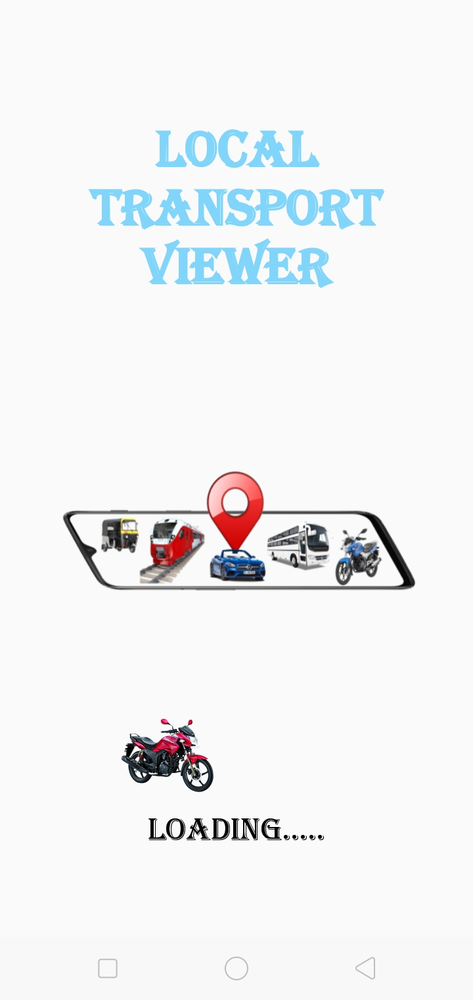
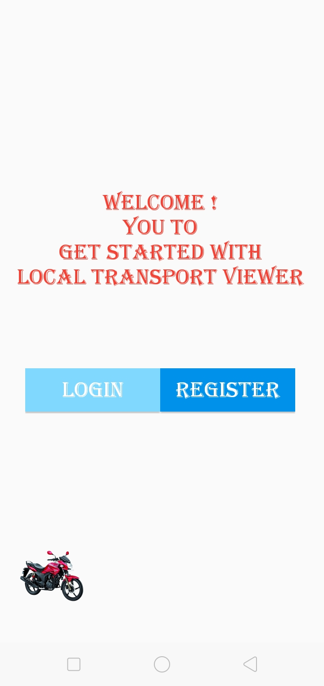
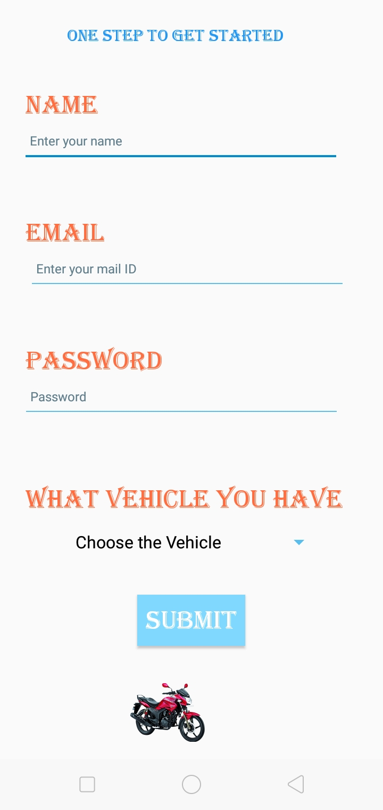
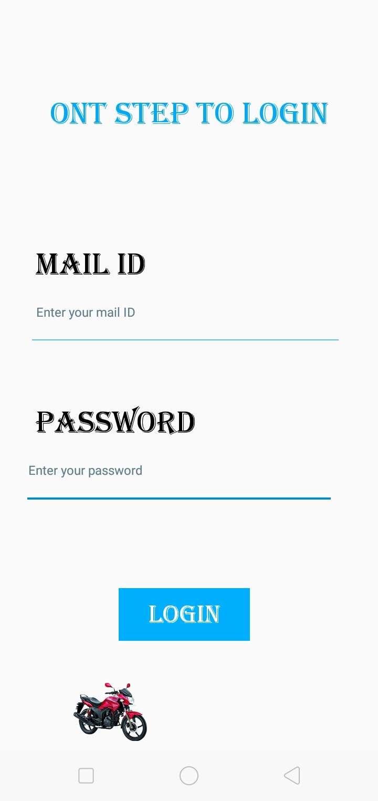
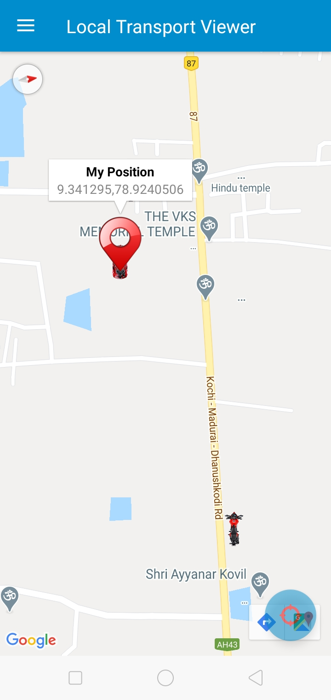
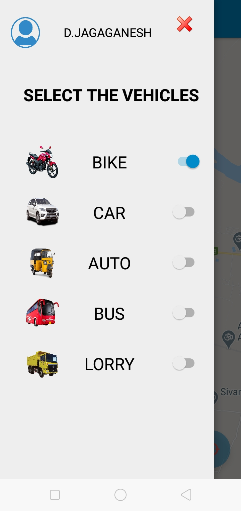
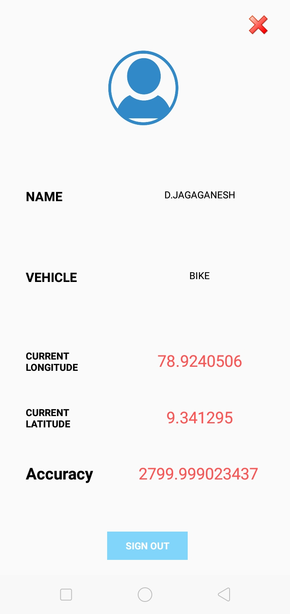
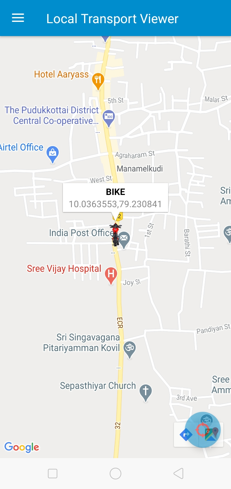

# LOCAL TRANSPORT VIEWER
An problem arises when he/she don't aware of local transport for their travel, Not everyone in our surrounding are financially settled. He/she thinks or being advised to book other transport like Ola, Uber, etc,.. Though we book such transport, it takes time to reach our pick-up location for costliest hire. So, the solution is creating an application on refreshing local transport availability. Hence we developed an mobile application know as <b>Local Transport Viewer</b> for viewing local transports to help the people’s to find local transport easily and also to help the local transport drivers to find their customers. 

## Implementaion
<ul>
  <b>1. Install Android Studio the IDE to develope Mobile Applications</b> 
  <b>2. Setup Firebase to authenticate and store users of the AppliCtion.</b> 
  <b>3. Link Firebase to Application using IDE.</b> 
  <b>4. Design Application using xml and java.</b> 
  <b>5. Export the Codes to apk and Upload in Play store.</b> 
  <b>6. Start Enjoying with Local Transport Viewer.</b>
</ul>

## Working
<b>
<ul type="square">
  <li>Start Running Application</li>
    

   
  <li>Welcome Page</li>
    

   
  <li>Registration Page</li>
    

   
  <li>Login Page</li>
    

   
  <li>Home Page</li>
    

   
  <li>Home Page - Side Navigation Bar</li>
    

   
  <li>User Profile Page</li>
    

   
  <li>Home Page - Near By Vehicles</li>
    

   
</ul>
</b>
 

## About Us
This project was done by <b>JagaGanesh D</b>, <b>Lokkeswaran S</b> and <b>Velmurugan M</b>. We are students of IT Department from Thiagarajar College of Engineering, Madurai. This project inspired by Design Thinking and Software Engineering the courses belongs to Second Year Third Semester of IT department (July 2020 - Decemper 2020)
